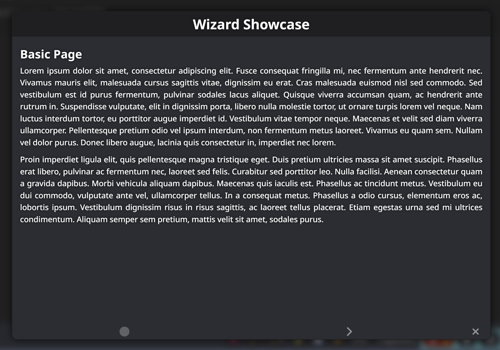
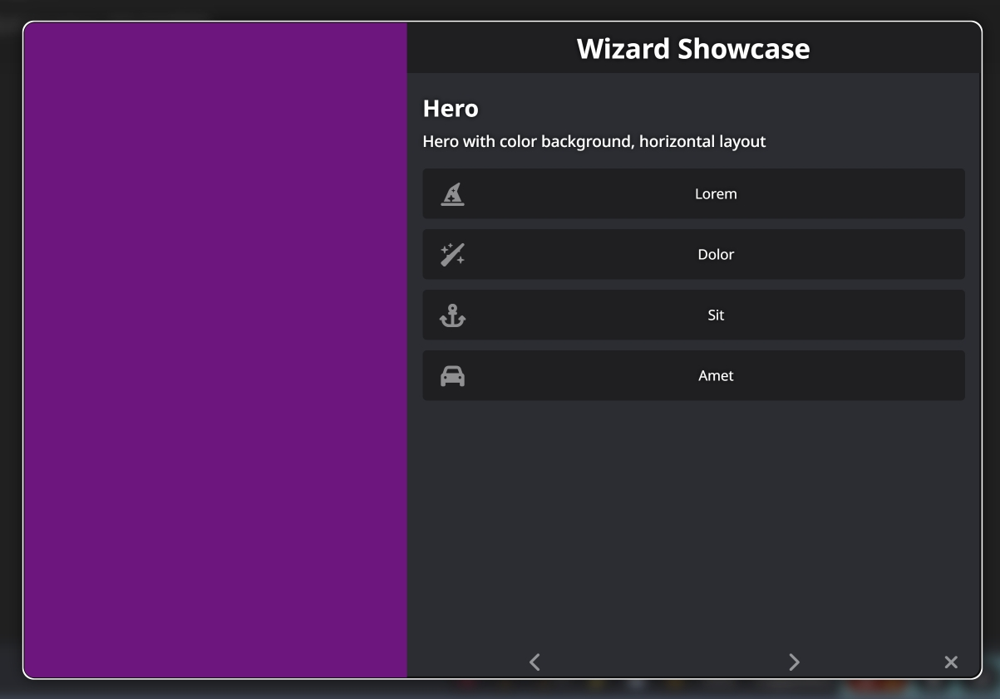
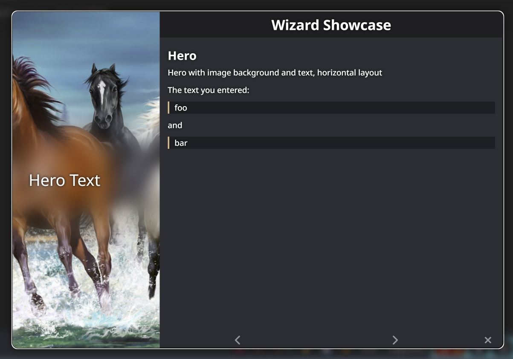
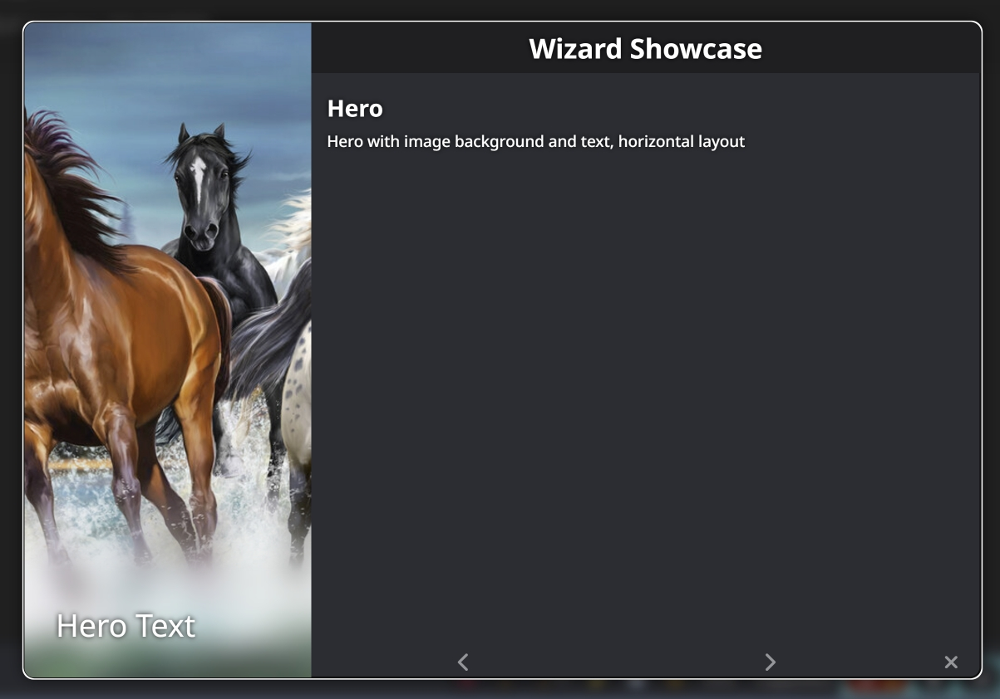
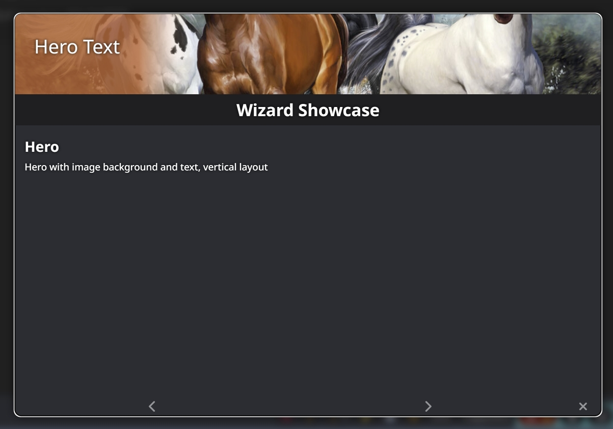
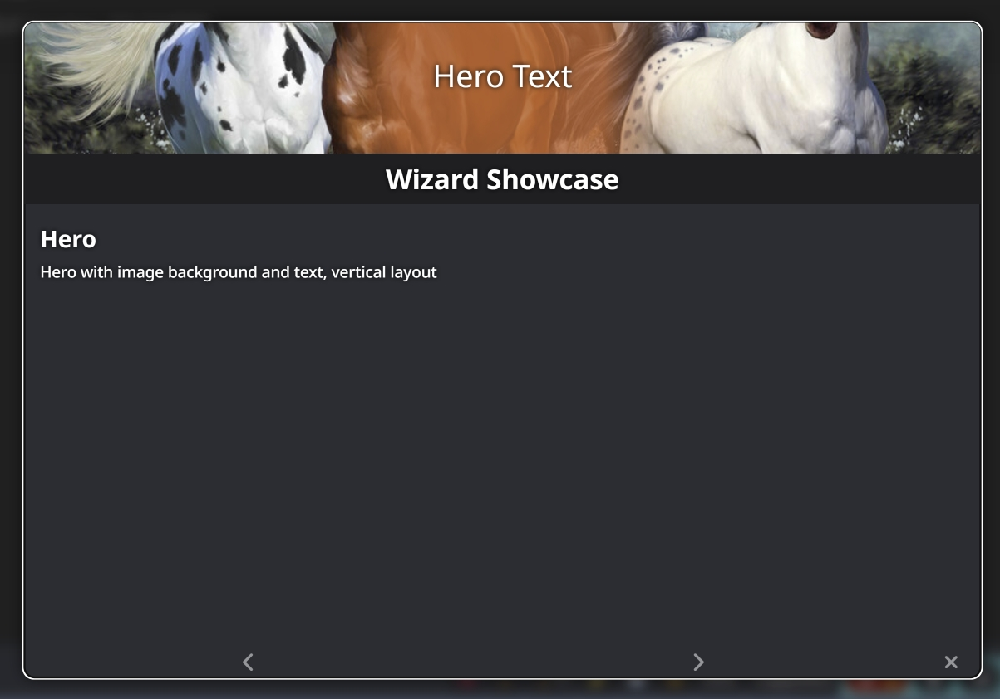
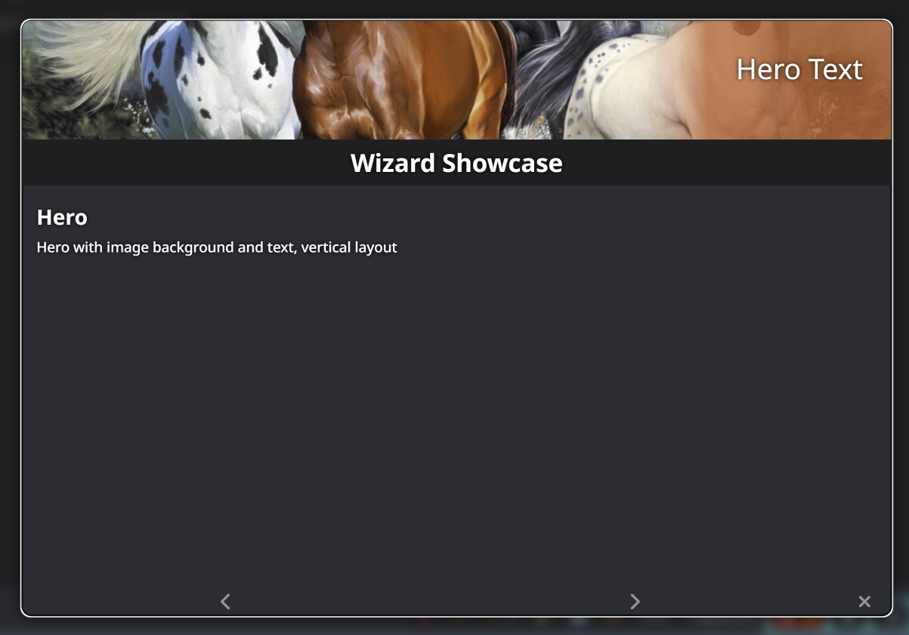
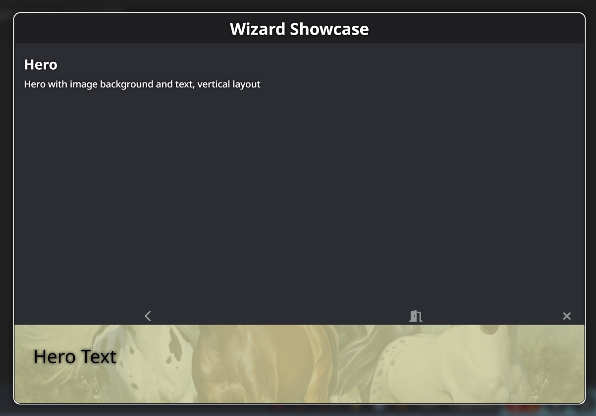

# SillyTavern - Wizard

Shows a Wizard to guide the user step-by-step through a list of pages.

| | | |
|-|-|-|
||||
||||
||||
||| |


```stscript
/wizard title="Simple Wizard" {:
	/wiz-nav |
	/wiz-page title="Page 1" {:
		/wiz-page-text This is a simple Wizard. |
	:} |
	/wiz-page title="Page 2" {:
		/wiz-page-text This is a the second page. |
	:} |
:} |
```
