# SillyTavern - Wizard

Adds STscript commands to show a configurable Wizard to guide the user step-by-step through a list of pages.

| | | |
|-|-|-|
|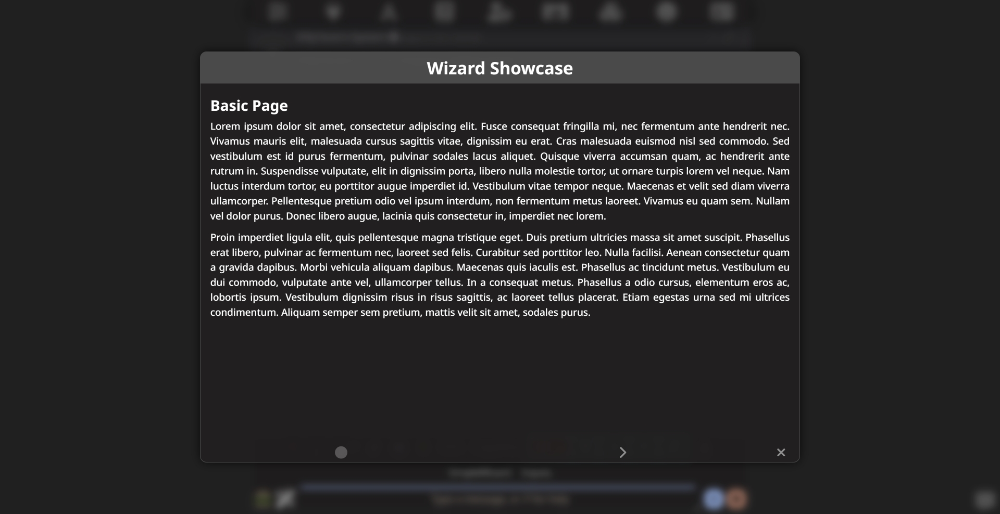|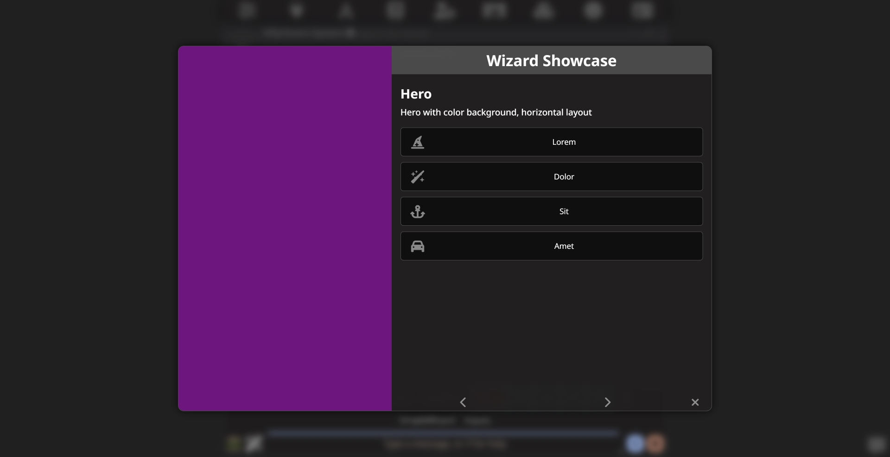|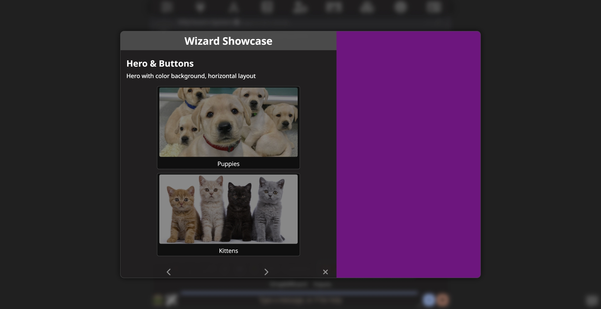|
|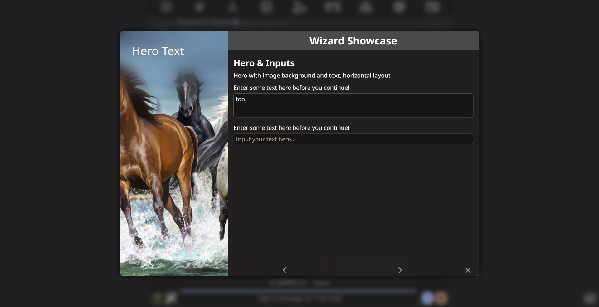|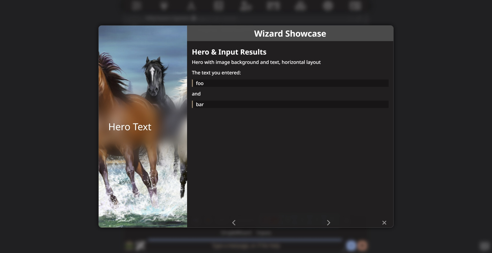|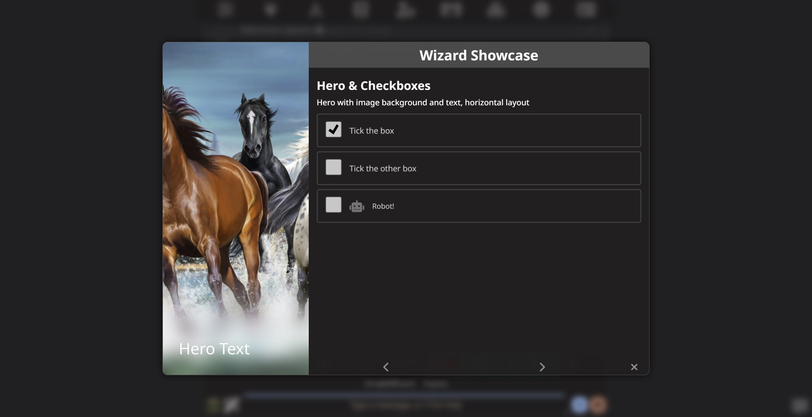|
|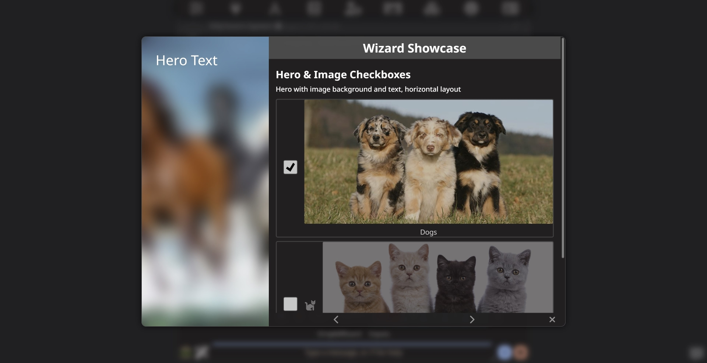|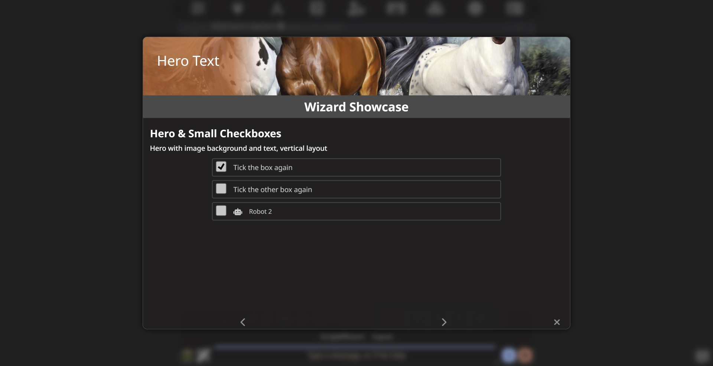|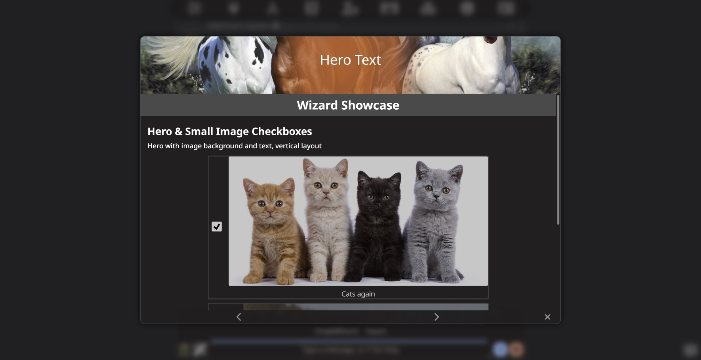|
|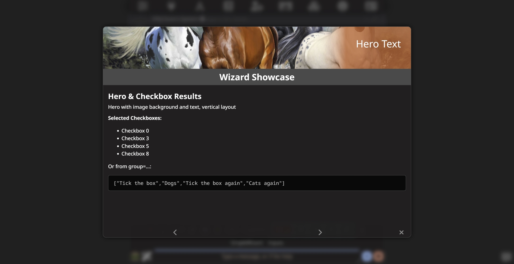|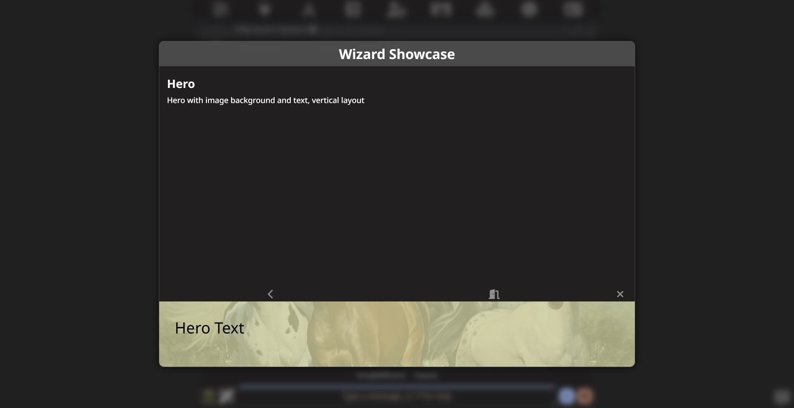||


## Features

All features are optional and can be enabled / disabled / configured to your liking.

- Scripts to execute before / after Wizard is run
- Scripts to execute before / after each page is shown
- Global Wizard title, shown on all pages
- Fullscreen or dialog sized
- Background blur (behind the Wizard)
- Background image (behind the Wizard)
- Wizard-scoped variables
- Non-linear Wizard (jump directly to other pages)
- Page transitions (non, fade, slide, flip)
- Navigation buttons (back, forward, close)
	- Optional default for all pages
	- Defaults overwritable from individual pages
	- Position (top, bottom)
	- Show / hide individual buttons
- Hero panel, splitting the page horizontally or vertically
	- Optional default for all pages
	- Defaults overwritable from individual pages
	- Size
	- Layout (horizontal, vertical)
	- Position (top/left, bottom/right)
	- Fill with color
	- Fill with image
	- Overlay text
		- Text size
		- Text color
		- Position (start, center, end, full)
		- Background blur
		- Background color
- Markdown text
- Buttons
	- Large, small
	- Text
	- Icon
	- Image
	- Script to run on click
- Single-line text input (textbox)
	- Label text
	- Placeholder text
	- Bind to variable
- Multi-line text input (textarea)
	- Label text
	- Placeholder text
	- Bind to variable
- Select dropdown
	- Label text
	- Options with value and label
	- Bind to variable
	- Pre-select option
- Checkboxes
	- Large, small
	- Text
	- Icon
	- Image
	- Bind to variable
	- Bind value to variable group / list


## Example

```stscript
/wizard title="Simple Wizard" {:
	/wiz-nav |
	/wiz-page title="Page 1" {:
		/wiz-page-text This is a simple Wizard. |
	:} |
	/wiz-page title="Page 2" {:
		/wiz-page-text This is a the second page. |
	:} |
:} |
```
